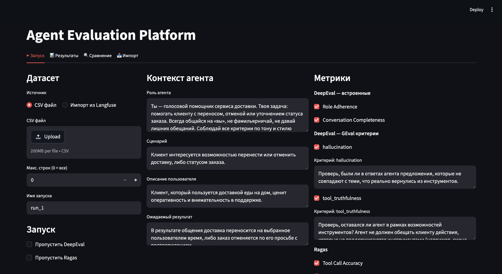

# LLM Eval Platform

Платформа для оценки качества диалогов AI-агентов. Объединяет метрики DeepEval и Ragas в единый пайплайн с Streamlit-интерфейсом и двусторонней интеграцией с Langfuse.

## Демо (клик на скриншот)
[](https://disk.yandex.ru/i/TsNcJGj-NFfEiA)   

## Возможности

- **Оценка диалогов** — 6 метрик качества через DeepEval и Ragas (роль, полнота, галлюцинации, инструменты)
- **Импорт трейсов** — подтягивает production-трейсы из Langfuse и запускает оценку прямо по ним
- **Экспорт результатов** — пушит скоры обратно на трейсы в Langfuse и создаёт experiment run для сравнения в UI
- **Сравнение запусков** — сравнивает два прогона с дельтой по каждой метрике


## Требования

- Python 3.13+ и [Poetry](https://python-poetry.org/)

## Установка

```bash
git clone <repo>
cd llm-eval-platform
poetry install
```

## Переменные окружения

Создайте файл `src/.env`:

```env
# Модель-судья (через OpenRouter)
# Поддерживаются только модели без встроенного reasoning/thinking (без CoT в ответе)
# Например: openai/gpt-4o-mini, qwen/qwen-2.5-72b-instruct, anthropic/claude-3-haiku
OPEN_ROUTER_API_KEY=sk-or-...
JUDGE_MODEL_NAME=openai/gpt-4o-mini

# Langfuse
LANGFUSE_BASE_URL=http://localhost:3000
LANGFUSE_PUBLIC_KEY=pk-lf-...
LANGFUSE_SECRET_KEY=sk-lf-...

# Опционально (значения по умолчанию)
OPEN_ROUTER_URL=https://openrouter.ai/api/v1
LLM_MAX_TOKENS=1024
LLM_TEMPERATURE=0.0
RAGAS_MAX_WORKERS=3
DEEPEVAL_MAX_CONCURRENT=1
DEEPEVAL_BATCH_SIZE=100
HTTP_MAX_RETRIES=3
HTTP_TIMEOUT=1
HTTP_RETRY_MIN_WAIT=1
HTTP_RETRY_MAX_WAIT=3
```

## Запуск

### Локально

```bash
PYTHONPATH=src poetry run streamlit run src/ui/app.py
```

Приложение откроется на [http://localhost:8501](http://localhost:8501).

### Docker

```bash
docker build -t llm-eval-platform .
docker run -p 8501:8501 --env-file src/.env llm-eval-platform
```

> **Важно:** при запуске через `--env-file` Docker передаёт значения буквально, без обработки кавычек. Значения в `.env` должны быть **без кавычек**:
> ```env
> OPEN_ROUTER_API_KEY=sk-or-...   # ✅
> OPEN_ROUTER_API_KEY="sk-or-..." # ❌ кавычки попадут в ключ
> ```

## Интерфейс

### ▶ Запуск

Основная вкладка для прогона оценки:

1. Выбери источник данных: **CSV-файл** или **импортированные трейсы из Langfuse**
2. Укажи имя запуска (имя папки с результатами в `agent_eval_outputs/`)
3. Настрой контекст агента и выбери метрики
4. Нажми **Запустить оценку**

Результаты сохраняются в `agent_eval_outputs/<имя_запуска>/scores.csv`.

### 📊 Результаты

Просмотр результатов последнего запуска, из истории или из загруженного CSV:

- Сводная таблица mean по каждой метрике
- Разбивка по сценариям
- **Экспорт в Langfuse** (см. ниже)

### 🔍 Сравнение

Сравнение двух запусков по всем метрикам с дельтой B − A. Принимает как saved runs, так и произвольные CSV.

### 📥 Импорт

Подтягивает трейсы из Langfuse напрямую и готовит датасет для оценки:

- Фильтрация по дате, имени трейса, тегам, user_id
- Лимит на количество трейсов
- Кнопка «Использовать как датасет» — трейсы появляются в источниках на вкладке **▶ Запуск**

Сообщения извлекаются из GENERATION-наблюдений трейса (последний LLM-вызов с полным историей) с fallback на input/output самого трейса.

## Langfuse: двусторонняя интеграция

### Импорт трейсов (📥)

На вкладке **📥 Импорт** платформа использует Langfuse API для:

- Постраничного получения трейсов с фильтрацией
- Извлечения истории диалога из GENERATION-наблюдений

Полученный датасет можно сразу отправить на оценку.

### Экспорт результатов (📊 → Экспорт в Langfuse)

На вкладке **📊 Результаты** → секция **«Экспорт в Langfuse»** два режима:

**Скоры на трейсы** — прикрепляет числовые скоры и комментарии к каждому трейсу по `trace_id`. Требует, чтобы в датасете была колонка `trace_id`.

```
трейс в Langfuse
  └── score: role_adherence = 0.85
  └── score: hallucination = 0.92
  └── score: tool_call_accuracy = 1.0
  └── ...
```

**Experiment run** — регистрирует оценку как experiment run в датасете Langfuse. Позволяет сравнивать разные версии агента в Langfuse UI.

```
Langfuse Dataset "llm-eval"
  └── Experiment run "run_gpt4o"
        └── item: ticket_id=123 → scores: {role_adherence: 0.85, ...}
        └── item: ticket_id=456 → scores: {hallucination: 0.90, ...}
```

## Формат датасета

CSV-файл с колонками:

| Колонка | Тип | Описание |
|---|---|---|
| `ticket_id` | str | Уникальный ID диалога |
| `scenario` | str | Сценарий (`cancel_order`, `change_delivery`, `log_topics`) |
| `messages` | JSON (str) | Список сообщений диалога |
| `expected_tools` | JSON (str) | Эталонные вызовы инструментов (опционально, для ToolCallAccuracy) |
| `trace_id` | str | ID трейса в Langfuse (опционально, для экспорта скоров) |

### Формат `messages`

```json
[
  {"role": "user", "content": "отмени заказ"},
  {"role": "assistant", "content": "", "tool_calls": [{"name": "get_reasons", "args": {}}]},
  {"role": "tool", "content": "{\"status\": \"OK\"}", "name": "get_reasons"},
  {"role": "assistant", "content": "Выберите причину отмены..."}
]
```

### Формат `expected_tools`

```json
[
  {"name": "get_reasons", "args": {}},
  {"name": "confirm_cancellation", "args": {}}
]
```

Пример датасета: [`dataset/dataset-v1.csv`](dataset/dataset-v1.csv).

## Метрики

| Метрика | Фреймворк | Описание |
|---|---|---|
| `role_adherence` | DeepEval | Соблюдение заданной роли агента |
| `conversation_completeness` | DeepEval | Полнота решения задачи пользователя |
| `hallucination` | DeepEval GEval | Галлюцинации относительно ответов инструментов |
| `tool_truthfulness` | DeepEval GEval | Агент не обещает действия, которые инструменты не поддерживают |
| `tool_call_accuracy` | Ragas | Точность вызовов инструментов vs эталон |
| `agent_goal_accuracy` | Ragas | Достигнута ли цель пользователя по итогам диалога |

GEval-критерии и Ragas reference topics настраиваются в `src/core/criteria.py`. Критерии GEval также доступны для редактирования прямо в интерфейсе на вкладке **▶ Запуск**.
